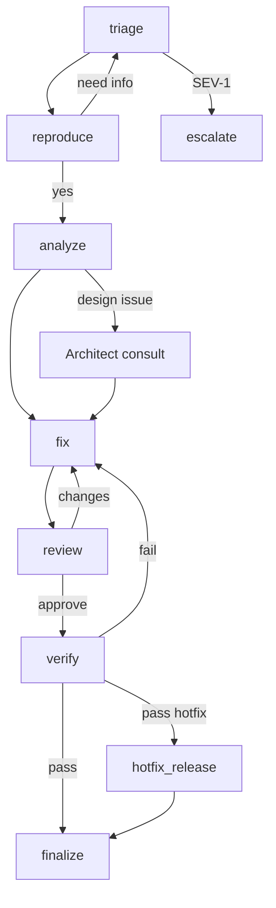

# BugFixGraph

Implements `workflows/fix-bug.md`.

## Purpose

버그 트리아지 → 재현 → 수정 → 리뷰 → 검증 → (핫픽스 시) Release 연동.

## State

```python
class BugFixState(TypedDict, total=False):
    run_id: str
    project_id: str
    bug_report_path: str
    severity: str                       # S0..S3 or maps to incident SEV
    priority: str
    reproducible: bool
    root_cause: str
    task_path: str
    pr_ref: str
    review_decision: str
    qa_decision: str
    hotfix: bool
    incident_linked: bool
    escalation: dict
    status: str
    artifacts: dict[str, str]
    messages: list[dict]
```

## Nodes

| Node | Role | Responsibility |
|------|------|----------------|
| `triage` | PM + QA | Severity, priority, accept/defer |
| `reproduce` | QA / Backend | Confirm repro steps |
| `analyze` | Backend (+ Architect if design) | Root cause hypothesis |
| `fix` | Backend / Frontend | Implement fix + regression test |
| `review` | Reviewer | Approve fix |
| `verify` | QA | Confirm fix + regression |
| `hotfix_release` | DevOps bridge | Start ReleaseGraph with hotfix flag |
| `escalate` | CEO | SEV-1 / deadlock |
| `finalize` | PM | Close bug task, memory note |

## Edges

```text
triage → reproduce           [accepted]
triage → finalize            [deferred/cancelled]
triage → escalate            [SEV-1 / policy]
reproduce → analyze          [reproducible]
reproduce → triage           [need more info]
analyze → fix
analyze → escalate           [design-level / data risk]
fix → review
review → verify              [approve]
review → fix                 [changes_requested]
verify → hotfix_release      [pass && hotfix]
verify → finalize            [pass && !hotfix]
verify → fix                 [fail]
hotfix_release → finalize
escalate → ...
```

## Diagram


