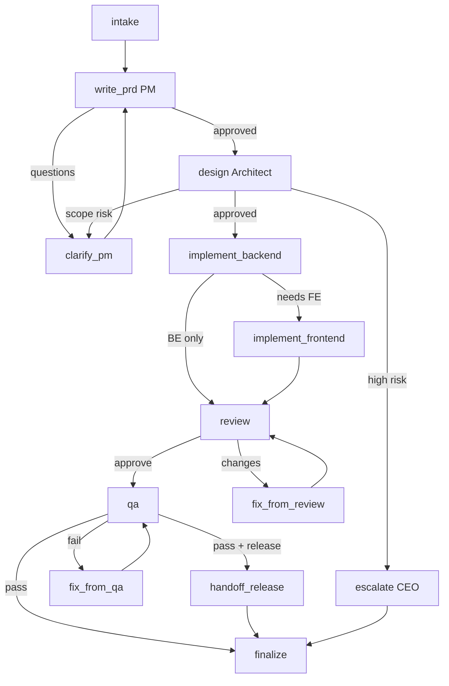

# FeatureGraph

Implements `workflows/create-feature.md`.

## Purpose

PRD → Design → Implement → Review → QA → (optional Release handoff) 를 Stateful Graph로 실행한다.

## State

```python
class FeatureState(TypedDict, total=False):
    run_id: str
    project_id: str
    feature_request: str
    priority: str                       # P0..P3
    prd_path: str
    architecture_path: str
    adr_paths: list[str]
    task_paths: list[str]
    api_spec_path: str
    pr_ref: str
    review_decision: str                # approve | changes_requested | block
    review_report_path: str
    qa_decision: str                    # pass | fail | conditional
    qa_report_path: str
    artifacts: dict[str, str]           # logical name → path
    open_questions: list[str]
    blockers: list[str]
    escalation: dict                    # {to, reason, packet_path}
    status: str                         # see Status enum
    messages: list[dict]                # agent chatter / tool traces
    needs_frontend: bool
    release_requested: bool
```

### Status Enum

`intake` → `prd` → `design` → `implement` → `review` → `qa` → `handoff_release` → `done`  
Branches: `clarify` → prior stage, `escalate` → `escalated`

## Nodes

| Node | Role | Responsibility | Writes |
|------|------|----------------|--------|
| `intake` | PM/CEO | Validate request, load project-memory | priority, status |
| `write_prd` | PM | Create PRD via write-prd skill | prd_path |
| `clarify_pm` | PM | Resolve open questions | open_questions |
| `design` | Architect | Architecture + ADR | architecture_path, adr_paths |
| `implement_backend` | Backend | API/code/tests | api_spec_path, pr_ref |
| `implement_frontend` | Frontend | UI (optional parallel) | artifacts.ui |
| `review` | Reviewer | code-review skill | review_decision, report |
| `fix_from_review` | Backend/FE | Address findings | pr_ref |
| `qa` | QA | Test plan + execution | qa_decision, report |
| `fix_from_qa` | Backend/FE | Bug fixes | task_paths |
| `escalate` | CEO | Strategic/high-risk resolution | escalation |
| `handoff_release` | DevOps bridge | Enqueue ReleaseGraph | status |
| `finalize` | PM | Memory update, close tasks | status=done |

## Edges

```text
intake → write_prd
write_prd → design            [if PRD approved]
write_prd → clarify_pm        [if open_questions]
write_prd → escalate          [if strategic conflict]
clarify_pm → write_prd
design → implement_backend    [if design approved]
design → clarify_pm           [if feasibility/scope issue]
design → escalate             [if high-risk ADR]
implement_backend → implement_frontend  [if needs_frontend]
implement_backend → review              [if not needs_frontend]
implement_frontend → review
review → qa                   [approve]
review → fix_from_review      [changes_requested]
review → escalate             [block policy]
fix_from_review → review
qa → finalize                 [pass && !release_requested]
qa → handoff_release          [pass && release_requested]
qa → fix_from_qa              [fail]
fix_from_qa → qa
escalate → (resume prior | cancelled)
handoff_release → finalize
finalize → END
```

## Diagram



## Approval Gates

Mapped from `workflows/create-feature.md` Approval Rules. Graph must not traverse forward without gate artifacts present in State.
