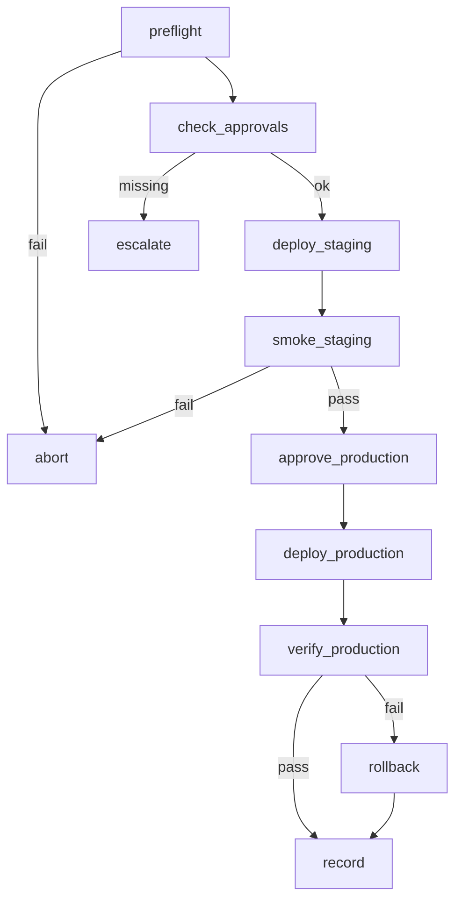

# ReleaseGraph

Implements `workflows/release.md` and skill `release-service`.

## Purpose

승인된 변경을 Staging → Production으로 배포하고 검증·기록·실패 시 Rollback한다.

## State

```python
class ReleaseState(TypedDict, total=False):
    run_id: str
    project_id: str
    version: str
    change_list_path: str
    qa_signoff_path: str
    release_notes_path: str
    environment: str                    # staging | production
    approvals: dict[str, bool]          # qa, architect, ceo, devops
    migration_required: bool
    migration_plan_path: str
    rollback_plan_path: str
    deploy_status: str                  # pending | in_progress | success | failed
    verification_passed: bool
    deployment_record_path: str
    rolled_back: bool
    hotfix: bool
    escalation: dict
    status: str
    messages: list[dict]
```

## Nodes

| Node | Role | Responsibility |
|------|------|----------------|
| `preflight` | DevOps | CI green, artifacts, secrets presence (vault) |
| `check_approvals` | DevOps | Approval Rules matrix |
| `deploy_staging` | DevOps | Staging deploy |
| `smoke_staging` | QA + DevOps | Smoke / golden checks |
| `approve_production` | Gate | Collect missing prod approvals |
| `deploy_production` | DevOps | Prod deploy (rolling/canary) |
| `verify_production` | QA + DevOps | SLO / health / golden txn |
| `rollback` | DevOps | Execute rollback plan |
| `record` | DevOps | Tag + Deployment Record + Memory |
| `escalate` | CEO | Deadlock / SEV |
| `abort` | DevOps | Stop without prod change |

## Edges

```text
preflight → check_approvals      [ok]
preflight → abort                [not ready]
check_approvals → deploy_staging [staging path ok]
check_approvals → escalate       [missing mandatory]
deploy_staging → smoke_staging
smoke_staging → approve_production [pass]
smoke_staging → abort            [fail]
approve_production → deploy_production [approvals complete]
approve_production → escalate    [blocked]
deploy_production → verify_production
verify_production → record       [pass]
verify_production → rollback     [fail]
rollback → record
record → END (released | rolled_back)
abort → END (aborted)
```

## Diagram



## Approval Matrix (encoded in `check_approvals` / `approve_production`)

| Kind | Required |
|------|----------|
| Staging | DevOps + CI |
| Prod Minor | DevOps + QA |
| Prod Major/Breaking | DevOps + QA + Architect + CEO |
| Emergency Hotfix | DevOps + CEO (QA parallel) |
